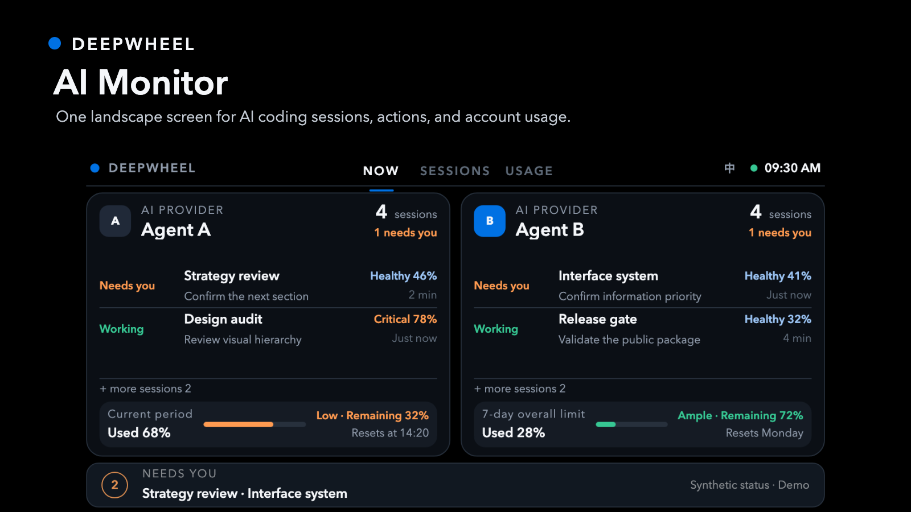
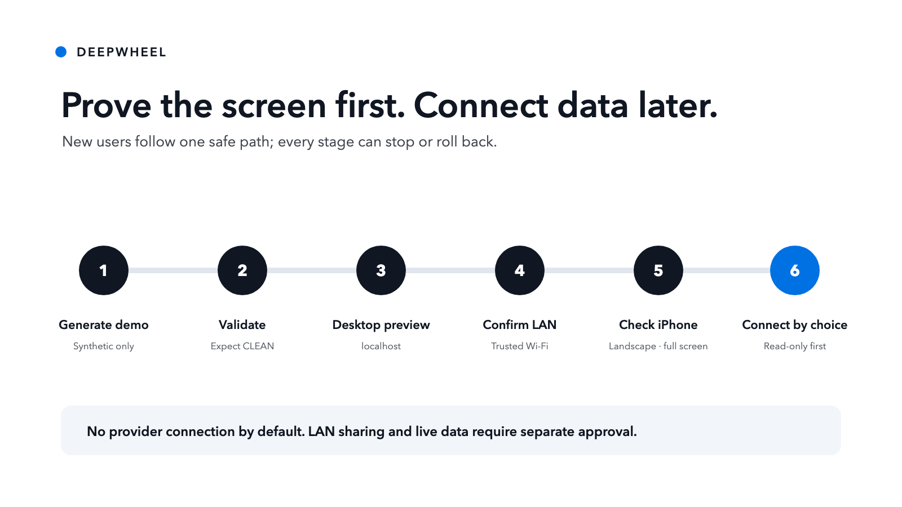

# AI Monitor

**English** | [简体中文](README.zh-CN.md)

Status: public community preview `v0.1.0-rc.3`. The stable macOS App is prepared separately and will appear in [Releases](https://github.com/lucaszsGH/ai-monitor/releases) only after its final release review.

**AI Monitor** is the product name. **DeepWheel** is the brand and the app-icon identity.



## Turn an iPhone into a Claude + Codex side screen

Place an iPhone in landscape beside your Mac and keep it charging. AI Monitor shows which local Claude or Codex sessions need you, how much subscription quota remains, and which models you used—without repeatedly switching windows.

- **See what needs you:** waiting, running, and review states stay visible.
- **Understand subscription use:** check remaining limits and recent usage at a glance.
- **Keep conversations private:** processing stays on the Mac; AI Monitor never reads chat content.

AI Monitor supports Claude-only, Codex-only, and dual-tool views. The first stable build targets Apple Silicon Macs running macOS 14 or later, plus iPhone X through iPhone 17 Pro Max in landscape.

## Download and first use

When the stable binary is published:

1. Download the Apple Silicon DMG from [Releases](https://github.com/lucaszsGH/ai-monitor/releases).
2. Open the bundled **1 · Installation Guide · GUIDE** before launching the App.
3. Choose Claude, Codex, or both.
4. Open the private LAN link on an iPhone using the same trusted Wi‑Fi.
5. In Safari, choose **Share → Add to Home Screen**, then use landscape.

The App is not Apple-notarized yet. macOS may require one **Open Anyway** approval in **System Settings → Privacy & Security**. The visual guide walks through that approval without disabling Mac security or running Terminal commands.

> A private LAN link is accessible only to devices on the same network that possess it. Share the link only when you intend someone else to view the summary.

See [App download and privacy boundary](docs/APP-DOWNLOAD.md).

## Community and source boundary

This repository is the public collaboration layer: documentation, the AI Monitor Skill, interface contracts, synthetic demos, validators, and adapter examples. Contributions through Issues and pull requests are welcome.

The distributed macOS App contains a private local runtime. Attaching a binary to this repository does **not** make that private runtime open source. See [license scope](LICENSE-SCOPE.md) and [trademark notice](TRADEMARKS.md).

## For developers: public Skill and demo

### What it does

This Agent Skill helps a user:

- separate quota, context-window health, and actual work context;
- group multiple sessions under each provider without summing their context percentages;
- switch manually between NOW, SESSIONS, and USAGE instead of auto-rotating;
- follow the system language by default, with a compact `EN／中` control for one-tap switching;
- start with a demo-data landscape PWA before connecting real sources;
- choose a low-risk local data path;
- apply the DeepWheel mobile landscape design contract;
- generate a starter without overwriting existing files;
- validate structure, privacy markers, safe areas, motion reduction, and deprecated brand values;
- prepare a local-only or private-network deployment plan.



### Quick Start

The first goal is not live-provider access. It is a reversible demo-data success in about ten minutes. See the complete walkthrough in [First Run](docs/FIRST-RUN.md).

### 1. Generate into a new or empty directory

```bash
python3 skills/lucas-deepwheel-ai-monitor/scripts/create_ai_monitor.py \
  --output ./ai-monitor-demo
```

### 2. Validate it

```bash
python3 skills/lucas-deepwheel-ai-monitor/scripts/validate_ai_monitor.py \
  ./ai-monitor-demo
```

### 3. Preview on the same computer

```bash
cd ai-monitor-demo
python3 -m http.server 8765 --bind 127.0.0.1
```

Then open `http://127.0.0.1:8765`.

### 4. Confirm trusted-LAN access for the iPhone

Stop the previous server with `Control+C`. After confirming that this is a trusted home or office Wi-Fi with no public port forwarding, run:

```bash
python3 -m http.server 8765 --bind 0.0.0.0
```

Open `http://COMPUTER-LAN-IP:8765/?debug=1` on the phone. Do not use `127.0.0.1` on the phone. The local-only diagnostic overlay reports viewport, safe area, overflow, and Home Screen mode; it does not transmit or store the values.

### 5. Full-screen on iPhone

A webpage cannot force Safari chrome to disappear. In Safari, use Share → Add to Home Screen, enable Open as Web App, then launch AI Monitor from its Home Screen icon. The starter includes standalone, landscape, and Apple web-app metadata. Its black base and symmetric safe-area guards visually merge the notch or Dynamic Island into the edge while keeping content outside the obstruction. Browser mode uses `100dvh`; Home Screen mode uses `100lvh` to avoid the large bottom gap observed on iOS landscape.

The starter uses synthetic demo data and neutral provider monograms. It does not read Claude, Codex, browser storage, credentials, transcripts, or project files.

The Home Screen uses the DeepWheel brand mark and the short app name **AI Monitor**. Its plain-language descriptor is “AI coding status screen.”


The same responsive implementation is also rendered at the iPhone X physical 3× class:


## Capability boundary

### Supported

- Landscape PWA information architecture.
- DeepWheel public landscape design contract.
- Demo-data starter generation.
- Static privacy and structure validation.
- Local-only and trusted-LAN deployment guidance.
- Generic Claude/Codex status normalization.
- Multi-session provider model with strict provider-level usage and session-level context separation.

### Requires tools, permissions, or human review

- Live Claude or Codex quota and context data.
- Background services, HTTPS, private networking, and push notifications.
- iPhone device testing for safe areas, text scaling, and long-running display.
- License and supply-chain review before reusing third-party adapters.

### Not promised

- Credential scraping or login bypasses.
- Stable access to undocumented provider endpoints.
- Automatic installation, remote exposure, publishing, push, Tag, or Release.
- Safe arbitrary remote command execution.
- Inferring real task completion from token consumption.

## Privacy model

The public package contains no real accounts, local paths, private project names, transcript content, or reusable credentials. It uses a minimal status contract and synthetic fixtures.

Keep personal overlays outside the public repository. See [docs/PRIVATE-OVERLAY.md](docs/PRIVATE-OVERLAY.md).

For safe live-data paths, see [docs/LIVE-DATA.md](docs/LIVE-DATA.md) and [docs/ADAPTER-CONTRACT.md](docs/ADAPTER-CONTRACT.md). The public package never ships provider trademarks or machine-specific adapters by default.

## Installation

Read [docs/INSTALLATION.md](docs/INSTALLATION.md). No installer runs automatically.

Preview a guarded local copy without writing files:

```bash
python3 scripts/install-local.py --destination /path/to/skills
```

The default is a dry run. Any `--apply` action requires explicit user confirmation.

## Troubleshooting

Use the [First Run recovery table](docs/FIRST-RUN.md#60-second-recovery) for phone access, Safari full-screen mode, safe-area overlap, bottom gaps, sleep recovery, and stopping local sharing.

## Validation

```bash
python3 scripts/validate-package.py
python3 -m unittest discover -s tests -p 'test_*.py' -v
python3 scripts/device-matrix-smoke.py
python3 scripts/device-matrix-smoke.py --font-scale 200
```

See [docs/TEST-RUNS.md](docs/TEST-RUNS.md) and [docs/REVIEW-RECORD.md](docs/REVIEW-RECORD.md).

The current requirement-by-requirement evidence is recorded in [docs/RELEASE-CANDIDATE-AUDIT.md](docs/RELEASE-CANDIDATE-AUDIT.md).

Real-device and release actions are separated in [docs/OWNER-ACCEPTANCE.md](docs/OWNER-ACCEPTANCE.md).

The macOS 1.0.0 binary candidate has a separate [release audit](docs/RELEASE-AUDIT-v1.0.0.md) and [release checklist](docs/RELEASE-CHECKLIST.md).

## Security

Read [SECURITY.md](SECURITY.md). Never publish credentials, session material, private customer data, full transcripts, complete sensitive logs, or machine-specific private overlays.

## Contributing

See [CONTRIBUTING.md](CONTRIBUTING.md). Changes to generators or validators require positive and negative tests.

## License

Public repository materials are MIT-licensed unless a file says otherwise. The downloadable App binary uses a separate binary license. See [LICENSE-SCOPE.md](LICENSE-SCOPE.md).
