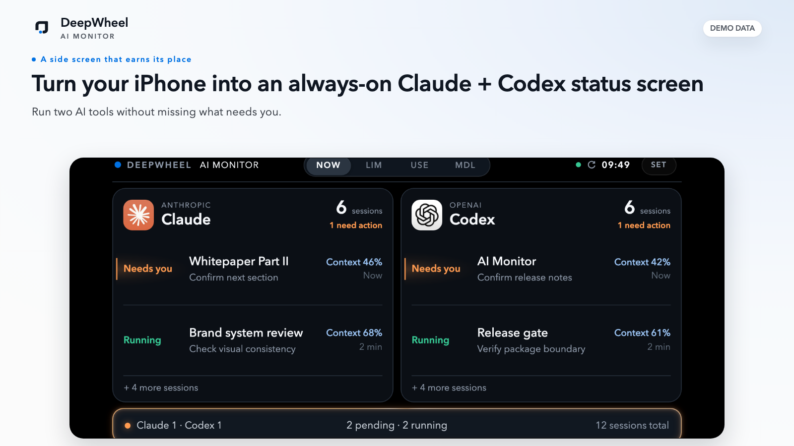
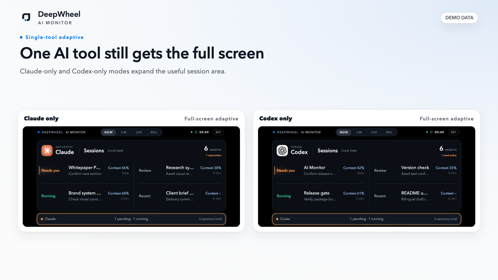
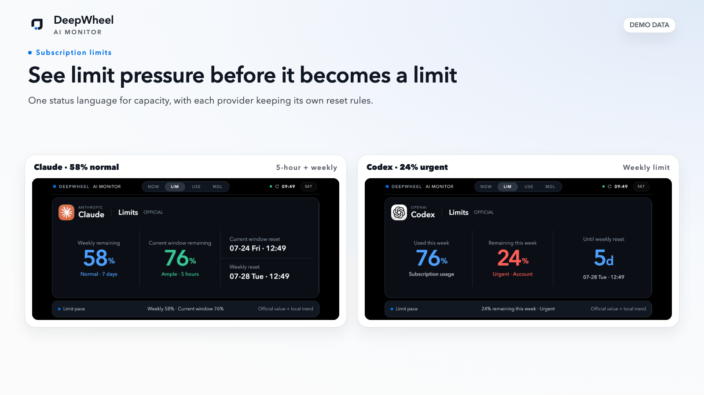
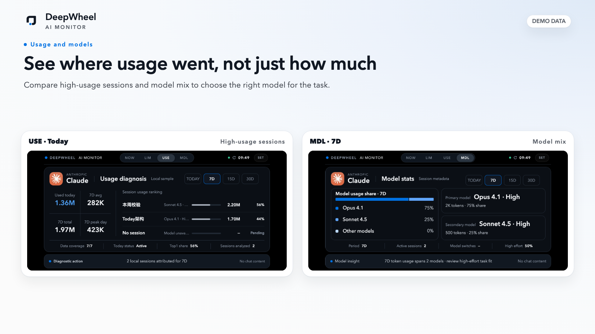
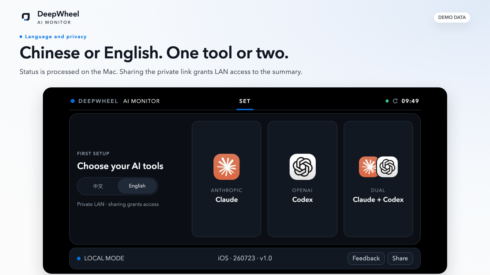
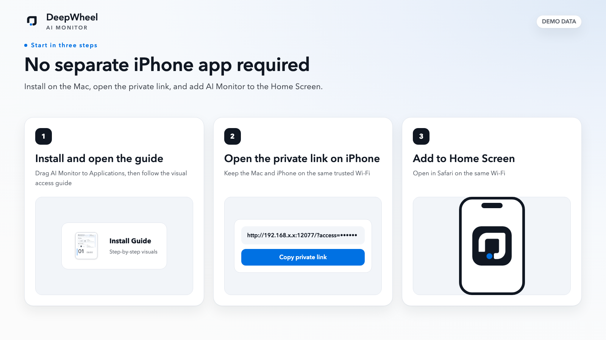

# AI Monitor｜Turn your iPhone into a Claude + Codex status screen

**English** | [简体中文](README.zh-CN.md)

Place an iPhone in landscape beside your Mac and keep it charging. See when Claude or Codex needs you, how much subscription capacity remains, and which models you have been using—without reopening every AI window.

Run **Claude, Codex, or both**. Status is processed locally on your Mac, and **chat content is never read**.

**[Download for macOS](https://github.com/lucaszsGH/ai-monitor/releases/latest)** · **[View the install guide](docs/APP-DOWNLOAD.md)** · **[Report an issue](https://github.com/lucaszsGH/ai-monitor/issues)**



## Why it exists

When Claude and Codex are working at the same time, the hard part is not opening another window. It is knowing:

- which session has finished and is waiting for you;
- when a subscription limit is getting close;
- where recent usage went;
- whether a powerful model was used where a lighter one may have been enough.

AI Monitor keeps those signals on the iPhone beside your Mac. Keep working. Look over when something actually needs you.

## One side screen, four useful signals

### Know when an AI needs you

NOW summarizes sessions that need attention and sessions still running. A restrained warm-orange signal draws the eye without adding another notification pop-up.

### One tool still gets the full screen

Choose Claude, Codex, or both. Single-tool mode expands the useful content instead of leaving half of a dual-tool screen empty.



### See limit pressure before it becomes a limit

LIM uses one status language for remaining capacity: 70% or more is sufficient, 50%–69% is normal, 30%–49% is low, and below 30% is urgent. Claude and Codex keep their own real reset semantics.



### See where usage went, not just how much

USE shows session-level usage for today and the selected period. MDL shows model mix, attribution coverage, and switching signals. Data that cannot be derived safely stays marked as unavailable or unattributed.



## Chinese or English. One tool or two.

Choose the language and tools during first setup, then change them from SET at any time. No separate iPhone App is required.



## Turn the iPhone into a side screen in three steps

1. Install AI Monitor on an Apple Silicon Mac.
2. Connect the iPhone to the same trusted Wi-Fi and open the private LAN link.
3. In Safari, choose **Share → Add to Home Screen**, then use the phone in landscape.

The current build is not Apple-notarized. The DMG includes a visual guide for the one-time **Open Anyway** approval in **System Settings → Privacy & Security**. **You do not need to disable Mac security or run Terminal commands.**



## Privacy boundary

- Status is processed on the Mac.
- AI Monitor does not read Claude or Codex chat content.
- Status data is not uploaded to a cloud service.
- Account credentials are not stored or published.
- Public screenshots use synthetic demo data.

Only devices on the same network that possess the complete private link can access the status summary. **Sharing the link grants access to that summary.**

> A private LAN link controls access; it is not the same as HTTPS transport encryption or end-to-end encryption. This release does not claim “local encryption.”

## Requirements and download

- Apple Silicon Mac, M1 or later;
- macOS 14 or later;
- iPhone X through iPhone 17 Pro Max;
- Mac and iPhone on the same trusted Wi-Fi;
- landscape use recommended.

**Current stable release: AI Monitor v1.0.0 · Build 21**

- [Download AI Monitor](https://github.com/lucaszsGH/ai-monitor/releases/latest)
- [Installation, first approval, and privacy boundary](docs/APP-DOWNLOAD.md)
- [Verify SHA-256 and read the release notes](https://github.com/lucaszsGH/ai-monitor/releases/tag/app-v1.0.0)

## FAQ

### Do I install an App on the iPhone?

No. Open the private link in Safari, then add AI Monitor to the Home Screen.

### Can I use only Claude or only Codex?

Yes. Choose Claude, Codex, or both during setup or later from SET.

### Does it read my chat content?

No. AI Monitor processes only the minimal status summary needed for the dashboard and does not read chat content.

### Why can macOS block the App the first time?

The current build is not Apple-notarized. The bundled visual guide shows the one-time approval in Privacy & Security. You do not need to disable Gatekeeper or run Terminal commands.

### Can someone else on the same Wi-Fi see it?

Only a device with the complete private link can access the summary. Sharing the link grants access, so share it only when intended.

## If it earns a place beside your Mac, star it

If AI Monitor earns a permanent spot beside your Mac, **star the project** to follow compatibility updates—and help more Claude and Codex users discover it.

**[Star on GitHub](https://github.com/lucaszsGH/ai-monitor)** · **[Report an issue](https://github.com/lucaszsGH/ai-monitor/issues)** · **[Share the public project](https://github.com/lucaszsGH/ai-monitor)**

Suggested share text:

> I turned a spare iPhone into a status screen beside my Mac. It shows when Claude or Codex needs me, how much subscription capacity remains, and which models I have been using—without reopening every AI window.

Sharing the public project never includes your private link, LAN address, real sessions, or usage data.

## Open collaboration and source boundary

Public collaboration package: `v0.1.0-rc.3`. The downloadable App has its own `v1.0.0` release line.

This repository is the public collaboration layer. It contains:

- product and installation documentation;
- the AI Monitor Skill;
- public UI and data contracts;
- synthetic demos, validators, and adapter examples;
- contribution paths for language, device compatibility, and onboarding.

Issues and [pull requests](CONTRIBUTING.md) are welcome.

The downloadable macOS App contains a private local runtime. MIT-licensed public materials and the separate App binary license have different scopes. Publishing the installer does not open-source the private runtime. See [license scope](LICENSE-SCOPE.md) and [trademark notice](TRADEMARKS.md).

## For developers: public Skill and demo

The public Skill generates a synthetic-data landscape PWA and helps developers reuse the information architecture, DeepWheel mobile design contract, privacy markers, safe-area handling, and adapter boundaries.

### Generate, validate, and preview

```bash
python3 skills/lucas-deepwheel-ai-monitor/scripts/create_ai_monitor.py \
  --output ./ai-monitor-demo

python3 skills/lucas-deepwheel-ai-monitor/scripts/validate_ai_monitor.py \
  ./ai-monitor-demo

cd ai-monitor-demo
python3 -m http.server 8765 --bind 127.0.0.1
```

See [First Run](docs/FIRST-RUN.md) for the complete walkthrough and [LIVE-DATA](docs/LIVE-DATA.md) plus [ADAPTER-CONTRACT](docs/ADAPTER-CONTRACT.md) for real-data boundaries.

### Repository validation

```bash
python3 scripts/validate-package.py
python3 -m unittest discover -s tests -p 'test_*.py' -v
python3 scripts/device-matrix-smoke.py
python3 scripts/device-matrix-smoke.py --font-scale 200
```

## License

Public repository materials are MIT-licensed unless a file says otherwise. The downloadable App binary uses a separate license. See [LICENSE-SCOPE.md](LICENSE-SCOPE.md).
