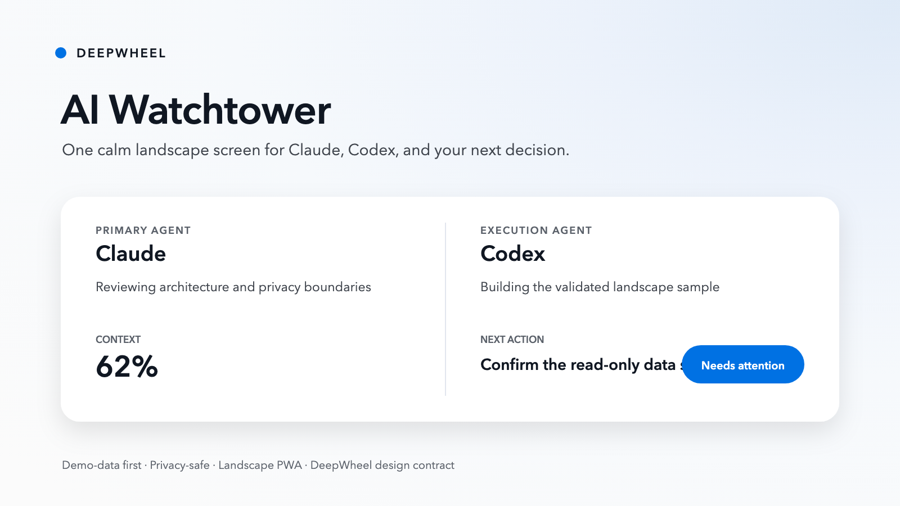

# Lucas-DeepWheel AI Watchtower

**English** | [简体中文](README.zh-CN.md)

Status: local public-release candidate. Current version: 0.1.0-rc.1. Not yet published.



## One-line value

Turn a landscape phone into a privacy-first status screen for Claude, Codex, and adjacent AI agents—without mirroring full conversations or exposing credentials.

## What it does

This Agent Skill helps a user:

- separate quota, context-window health, and actual work context;
- start with a demo-data landscape PWA before connecting real sources;
- choose a low-risk local data path;
- apply the DeepWheel mobile landscape design contract;
- generate a starter without overwriting existing files;
- validate structure, privacy markers, safe areas, motion reduction, and deprecated brand values;
- prepare a local-only or private-network deployment plan.


## Quick Start

Generate into a new or empty directory:

```bash
python3 skills/lucas-deepwheel-ai-watchtower/scripts/create_watchtower.py \
  --output ./watchtower-demo
```

Validate it:

```bash
python3 skills/lucas-deepwheel-ai-watchtower/scripts/validate_watchtower.py \
  ./watchtower-demo
```

Preview on the same computer:

```bash
cd watchtower-demo
python3 -m http.server 8765 --bind 127.0.0.1
```

Then open `http://127.0.0.1:8765`.

The starter uses synthetic demo data. It does not read Claude, Codex, browser storage, credentials, transcripts, or project files.


The same responsive implementation is also rendered at the iPhone X physical 3× class:


## Capability boundary

### Supported

- Landscape PWA information architecture.
- DeepWheel public landscape design contract.
- Demo-data starter generation.
- Static privacy and structure validation.
- Local-only and trusted-LAN deployment guidance.
- Generic Claude/Codex status normalization.

### Requires tools, permissions, or human review

- Live Claude or Codex quota and context data.
- Background services, HTTPS, private networking, and push notifications.
- iPhone device testing for safe areas, text scaling, and long-running display.
- License and supply-chain review before reusing third-party adapters.

### Not promised

- Credential scraping or login bypasses.
- Stable access to undocumented provider endpoints.
- Automatic installation, remote exposure, publishing, push, Tag, or Release.
- Safe arbitrary remote command execution.
- Inferring real task completion from token consumption.

## Privacy model

The public package contains no real accounts, local paths, private project names, transcript content, or reusable credentials. It uses a minimal status contract and synthetic fixtures.

Keep personal overlays outside the public repository. See [docs/PRIVATE-OVERLAY.md](docs/PRIVATE-OVERLAY.md).

## Installation

Read [docs/INSTALLATION.md](docs/INSTALLATION.md). No installer runs automatically.

Preview a guarded local copy without writing files:

```bash
python3 scripts/install-local.py --destination /path/to/skills
```

The default is a dry run. Any `--apply` action requires explicit user confirmation.

## Validation

```bash
python3 scripts/validate-package.py
python3 -m unittest discover -s tests -p 'test_*.py' -v
python3 scripts/device-matrix-smoke.py
python3 scripts/device-matrix-smoke.py --font-scale 200
```

See [docs/TEST-RUNS.md](docs/TEST-RUNS.md) and [docs/REVIEW-RECORD.md](docs/REVIEW-RECORD.md).

## Security

Read [SECURITY.md](SECURITY.md). Never publish credentials, session material, private customer data, full transcripts, complete sensitive logs, or machine-specific private overlays.

## Contributing

See [CONTRIBUTING.md](CONTRIBUTING.md). Changes to generators or validators require positive and negative tests.

## License

MIT License. See [LICENSE](LICENSE).
