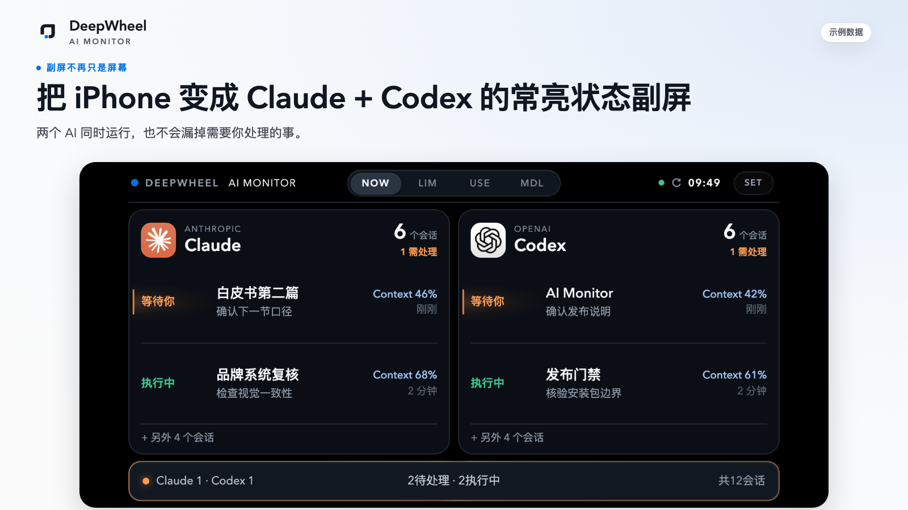
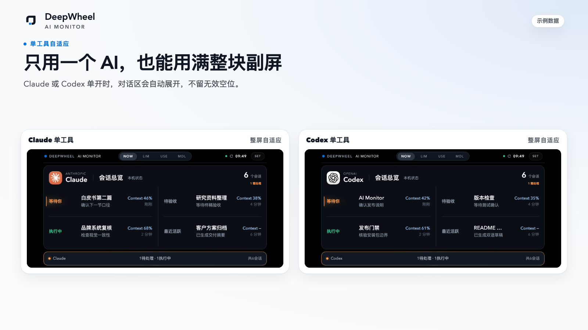
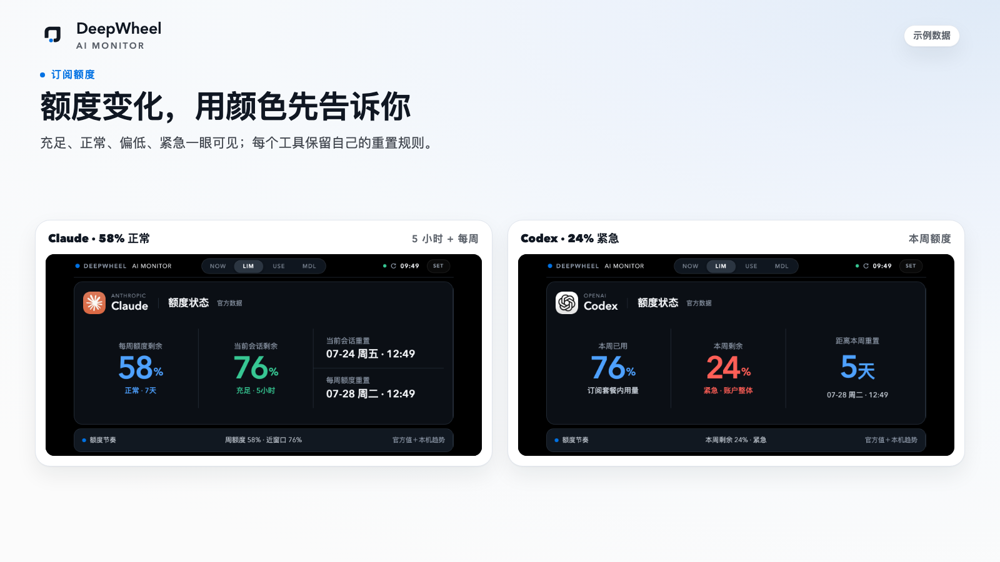
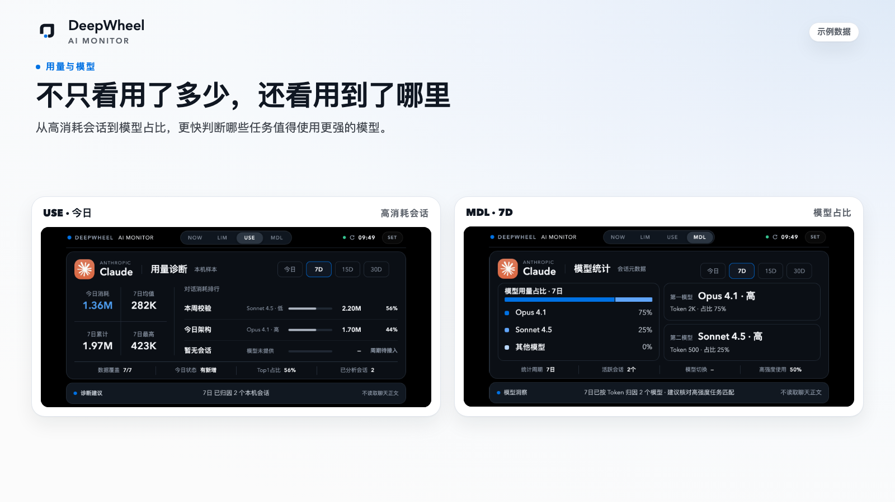
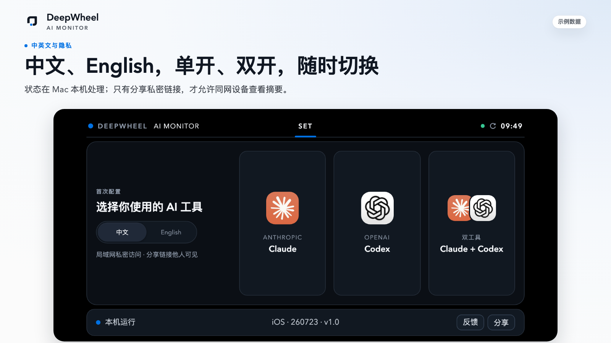
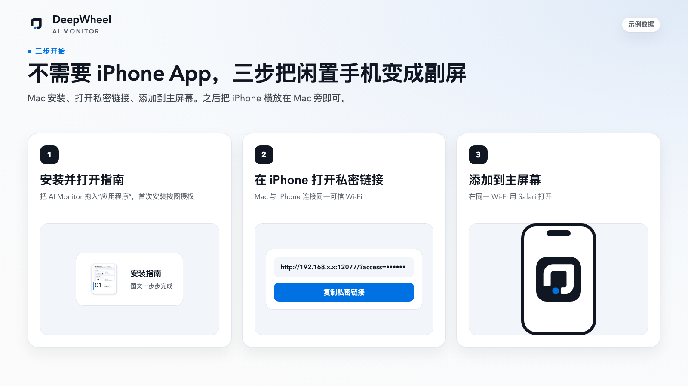

# AI Monitor｜把 iPhone 变成 Claude + Codex 状态副屏

[English](README.md) | **简体中文**

把 iPhone 横放在 Mac 旁并保持充电。Claude 或 Codex 是否正在等你、订阅额度还剩多少、最近主要用了什么模型，抬眼就能看到，不用反复切换窗口。

支持 **Claude 单开、Codex 单开和双开**。状态在 Mac 本机处理，**不读取对话正文**。

**[下载 macOS 正式版](https://github.com/lucaszsGH/ai-monitor/releases/latest)** · **[查看安装图文](docs/APP-DOWNLOAD.zh-CN.md)** · **[反馈问题](https://github.com/lucaszsGH/ai-monitor/issues)**



## 为什么会需要它

同时运行 Claude 和 Codex 时，真正麻烦的不是再开一个窗口，而是：

- 不知道哪个会话已经做完、正在等你确认；
- 来回切换窗口，注意力被不断打断；
- 快到额度限制时，才发现本周期消耗过快；
- 只看到 Token 数，却不知道消耗主要去了哪个会话、哪个模型。

AI Monitor 把这些高频状态放到 Mac 旁边的 iPhone 上。你继续工作，需要你时再抬眼看一眼。

## 一块副屏，看清四件事

### AI 在等你时，马上看到

NOW 汇总当前待处理与执行中的会话。需要你确认、补充或验收时，页面使用克制的暖橙提醒，不靠弹窗打断工作。

### 只用一个 AI，也能用满整块屏幕

选择 Claude、Codex 或双工具。单工具模式会自动扩大有效信息区，不是把双工具页面简单留空一半。



### 在触顶之前，看见额度变化

LIM 通过状态色显示剩余额度：70% 及以上为充足，50%–69% 为正常，30%–49% 为偏低，30% 以下为紧急。Claude 与 Codex 保留各自的真实额度周期，不混用规则。



### 不只看用了多少，还看用到了哪里

USE 显示今日与所选周期的会话消耗；MDL 显示模型用量结构、归因覆盖和切换情况。无法可靠判断的数据会明确显示“未提供”或“未归因”，不会用猜测补齐。



## 中文、English，单开、双开，随时调整

首次配置选择语言与 AI 工具，之后可从 SET 随时切换。无需在 iPhone 安装单独 App。



## 三步把 iPhone 变成副屏

1. 在 Apple 芯片 Mac 上安装 AI Monitor；
2. 让 iPhone 与 Mac 连接同一可信 Wi‑Fi，打开局域网私密链接；
3. Safari 点“分享 → 添加到主屏幕”，横屏放在 Mac 旁。

当前 App 尚未经过 Apple 公证。安装包内附图文指南，首次打开可能需要在“系统设置 → 隐私与安全性”中选择一次“仍要打开”。**不需要关闭 Mac 安全保护，也不需要执行终端命令。**



## 隐私边界

- 状态在 Mac 本机处理；
- 不读取 Claude 或 Codex 的对话正文；
- 不把状态数据上传到云端；
- 不保存或公开账号凭证；
- 公开截图只使用合成示例数据。

只有同一局域网内持有完整私密链接的设备才能访问状态摘要。**分享链接即允许对方查看摘要，请只在确实希望他人查看时分享。**

> “局域网私密链接”用于访问控制，不等于 HTTPS 或端到端加密；本项目不作“本地加密”承诺。

## 系统要求与下载

- Apple 芯片 Mac（M1 或更新）；
- macOS 14 或更新版本；
- iPhone X 至 iPhone 17 Pro Max；
- Mac 与 iPhone 位于同一可信 Wi‑Fi；
- 推荐横屏、连接电源，并按需要调整自动锁定设置。

**当前正式版：AI Monitor v1.0.0 · Build 21**

- [下载 AI Monitor](https://github.com/lucaszsGH/ai-monitor/releases/latest)
- [安装、首次授权与隐私说明](docs/APP-DOWNLOAD.zh-CN.md)
- [核对 SHA-256 与 Release Notes](https://github.com/lucaszsGH/ai-monitor/releases/tag/app-v1.0.0)

## 常见问题

### 需要在 iPhone 安装 App 吗？

不需要。用 Safari 打开 Mac 提供的私密链接，再添加到主屏幕即可。

### 可以只监控 Claude 或只监控 Codex 吗？

可以。首次设置或 SET 页面可以选择 Claude、Codex 或双工具。

### 会读取我的聊天内容吗？

不会。AI Monitor 只处理仪表盘所需的最小状态摘要，不读取对话正文。

### 为什么第一次打开会被 macOS 阻止？

当前版本尚未经过 Apple 公证。安装包内的图文指南会引导你完成一次授权，不需要关闭 Gatekeeper，也不需要运行终端命令。

### 同一 Wi‑Fi 下的其他人能看到吗？

只有持有完整私密链接的设备可以访问。不要随意分享；分享即代表允许对方查看摘要。

## 喜欢它，再留下一个 Star

如果 AI Monitor 在你的 Mac 旁找到了固定位置，可以给项目一个 **Star**，方便找到后续适配更新，也让更多同时使用 Claude 和 Codex 的人发现它。

**[GitHub · Star](https://github.com/lucaszsGH/ai-monitor)** · **[反馈问题](https://github.com/lucaszsGH/ai-monitor/issues)** · **[分享公开项目页](https://github.com/lucaszsGH/ai-monitor)**

推荐分享文案：

> 我把一台闲置 iPhone 放在 Mac 旁当 AI 副屏了。Claude 或 Codex 在等我、额度还剩多少、最近用了哪些模型，抬眼就能看到，不用来回切窗口。AI Monitor 支持单开和双开，状态在 Mac 本机处理，也不读取对话正文。

分享公开项目页不会包含你的私密链接、局域网地址、真实会话或使用数据。

## 开放协作与源码边界

公开协作包版本：`v0.1.0-rc.3`；可下载 App 使用独立的 `v1.0.0` 版本线。

本仓库是公开共建层，提供：

- 产品与安装文档；
- AI Monitor Skill；
- 公开界面与数据合同；
- 合成 Demo、校验器和适配示例；
- 多语言、设备适配与使用体验的贡献入口。

欢迎提交 [Issue](https://github.com/lucaszsGH/ai-monitor/issues) 和 [Pull Request](CONTRIBUTING.md)。

可下载的 macOS App 包含私有本机运行核心。MIT 开源材料与 App 二进制许可范围不同；公开安装包不代表私有运行核心已经开源。详见[许可范围](LICENSE-SCOPE.md)与[商标声明](TRADEMARKS.md)。

## 面向开发者：公开 Skill 与 Demo

公开 Skill 可生成使用合成数据的横屏 PWA，帮助开发者复用信息架构、DeepWheel 移动端设计合同、隐私标记、安全区和数据适配边界。

### 生成、校验与预览

```bash
python3 skills/lucas-deepwheel-ai-monitor/scripts/create_ai_monitor.py \
  --output ./ai-monitor-demo

python3 skills/lucas-deepwheel-ai-monitor/scripts/validate_ai_monitor.py \
  ./ai-monitor-demo

cd ai-monitor-demo
python3 -m http.server 8765 --bind 127.0.0.1
```

完整步骤见[第一次使用](docs/FIRST-RUN.zh-CN.md)，真实数据边界见 [LIVE-DATA](docs/LIVE-DATA.md) 与 [ADAPTER-CONTRACT](docs/ADAPTER-CONTRACT.md)。

### 仓库校验

```bash
python3 scripts/validate-package.py
python3 -m unittest discover -s tests -p 'test_*.py' -v
python3 scripts/device-matrix-smoke.py
python3 scripts/device-matrix-smoke.py --font-scale 200
```

## License

公开仓库材料如无单独说明，采用 MIT License。可下载 App 安装包适用独立二进制许可，见 [LICENSE-SCOPE.md](LICENSE-SCOPE.md)。
