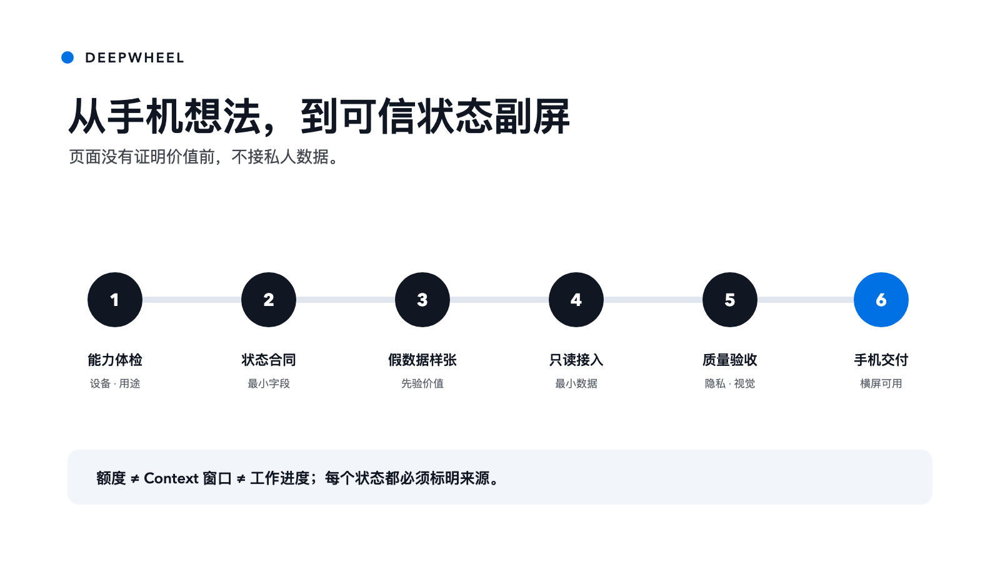
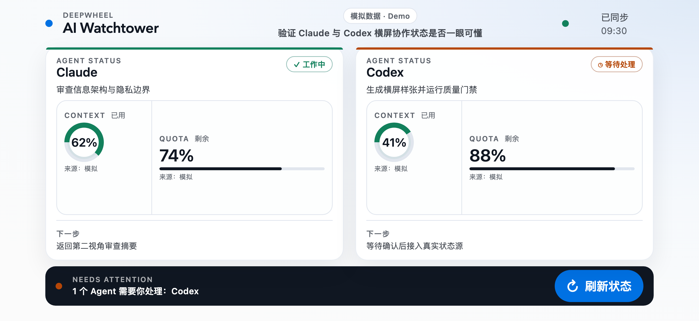

# Lucas-DeepWheel AI Watchtower｜AI 横屏瞭望塔

[English](README.md) | **简体中文**

状态：本地公开发布候选；当前版本 0.1.0-rc.1；尚未公开发布。


## 一句话价值

把横屏手机变成 Claude、Codex 和相邻 AI Agent 的安全状态副屏，同时避免镜像完整聊天或暴露凭证。

## 它能做什么

这个 Agent Skill 帮助用户：

- 分清额度、Context 窗口健康和真正的工作上下文；
- 先用假数据 PWA 验证横屏价值，再接真实状态源；
- 选择低风险的本机数据路径；
- 应用 DeepWheel 手机横屏设计合同；
- 在不覆盖现有文件的前提下生成 starter；
- 检查结构、隐私标记、安全区、减少动效和品牌废值；
- 规划本机或私人网络部署。



## 快速开始

生成到一个全新或空目录：

```bash
python3 skills/lucas-deepwheel-ai-watchtower/scripts/create_watchtower.py \
  --output ./watchtower-demo
```

运行校验：

```bash
python3 skills/lucas-deepwheel-ai-watchtower/scripts/validate_watchtower.py \
  ./watchtower-demo
```

仅在当前电脑预览：

```bash
cd watchtower-demo
python3 -m http.server 8765 --bind 127.0.0.1
```

然后打开 `http://127.0.0.1:8765`。

starter 只使用合成假数据，不读取 Claude、Codex、浏览器存储、凭证、会话全文或项目文件。



同一套响应式实现也按 iPhone X 物理 3× 级尺寸完成渲染：


## 能力边界

### 已支持

- 手机横屏 PWA 信息架构；
- DeepWheel 公开横屏设计合同；
- 假数据 starter 生成；
- 静态隐私和结构校验；
- 本机与可信局域网部署说明；
- 通用 Claude/Codex 状态归一化。

### 需要工具、权限或人工复核

- Claude/Codex 真实额度与 Context 数据；
- 后台服务、HTTPS、私人网络和推送；
- iPhone 安全区、文本缩放和长时间显示真机测试；
- 复用第三方适配器前的许可与供应链审查。

### 暂不承诺

- 抓取凭证或绕过登录；
- 稳定访问平台未公开接口；
- 自动安装、外网暴露、发布、push、Tag 或 Release；
- 安全地远程执行任意命令；
- 根据 Token 消耗准确推断任务是否完成。

## 私人信息边界

公开包不包含真实账号、本机路径、私人项目名、会话正文或可复用凭证，只提供最小状态合同和合成数据。

私人覆盖层必须留在公开仓库之外。见 [docs/PRIVATE-OVERLAY.md](docs/PRIVATE-OVERLAY.md)。

## 安装

见 [docs/INSTALLATION.md](docs/INSTALLATION.md)。本仓库不会自动运行安装程序。

不写文件地预览受保护的本地安装：

```bash
python3 scripts/install-local.py --destination /path/to/skills
```

默认只做 dry run。任何 `--apply` 动作都必须先获得用户明确确认。

## 校验

```bash
python3 scripts/validate-package.py
python3 -m unittest discover -s tests -p 'test_*.py' -v
python3 scripts/device-matrix-smoke.py
python3 scripts/device-matrix-smoke.py --font-scale 200
```

测试和评审记录见 [docs/TEST-RUNS.md](docs/TEST-RUNS.md) 与 [docs/REVIEW-RECORD.md](docs/REVIEW-RECORD.md)。

## 安全

见 [SECURITY.md](SECURITY.md)。不得公开凭证、会话材料、私密客户资料、聊天全文、完整敏感日志或机器专属私人覆盖层。

## 贡献

见 [CONTRIBUTING.md](CONTRIBUTING.md)。修改生成器或校验器时必须同时增加正向和负向测试。

## License

MIT License，见 [LICENSE](LICENSE)。
