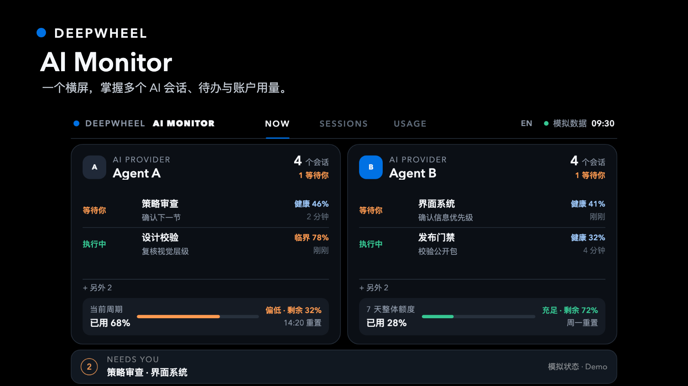
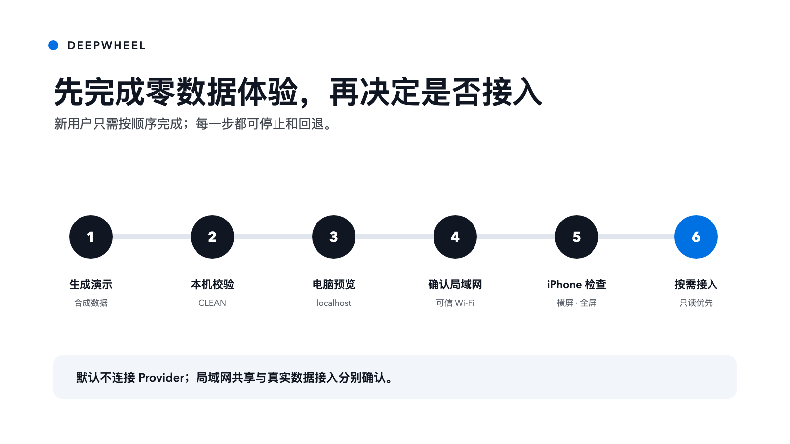
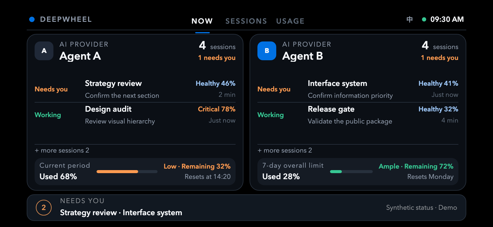

# AI Monitor｜AI 编程状态副屏

[English](README.md) | **简体中文**

状态：GitHub 公开社区预览版 `v0.1.0-rc.3`。稳定版 macOS App 独立准备，只有通过最终发布审计后才会出现在 [Releases](https://github.com/lucaszsGH/ai-monitor/releases)。

**AI Monitor** 是产品名，**DeepWheel** 是品牌与应用图标识别。



## 把 iPhone 变成 Claude + Codex 的常亮副屏

把 iPhone 横放在 Mac 旁并保持充电。AI Monitor 会持续显示哪些 Claude／Codex 本机会话正在等你、订阅额度还剩多少、最近主要用了什么模型，不用反复切窗口。

- **不漏处理：** 等待、执行、待验收等状态持续可见；
- **看清订阅消耗：** 剩余额度与近期用量一眼可查；
- **不读取正文：** 状态在 Mac 本机处理，AI Monitor 不读取对话正文。

支持 Claude 单开、Codex 单开和双开。首个稳定版面向 macOS 14 及以上 Apple 芯片 Mac，以及 iPhone X 至 iPhone 17 Pro Max 横屏。

## 下载与首次使用

稳定版安装包发布后：

1. 从 [Releases](https://github.com/lucaszsGH/ai-monitor/releases) 下载 Apple 芯片 DMG；
2. 启动前先打开安装包里的 **1 · 安装指南 · GUIDE**；
3. 选择 Claude、Codex 或双开；
4. 让 iPhone 与 Mac 连接同一可信 Wi‑Fi，再打开本机私密链接；
5. Safari 点“分享 → 添加到主屏幕”，然后横屏使用。

当前 App 尚未经过 Apple 公证，macOS 可能要求你在“系统设置 → 隐私与安全性”中完成一次“仍要打开”。安装包自带图文指引，不需要关闭 Mac 安全保护，也不需要运行终端命令。

> 私密链接仅允许同一局域网内持有链接的设备访问。只有确实希望他人查看摘要时才分享。

完整说明见[安装包与隐私边界](docs/APP-DOWNLOAD.zh-CN.md)。

## 社区与源码边界

本仓库是公开共建层：包含文档、AI Monitor Skill、界面合同、合成 Demo、校验器和适配器示例，欢迎通过 Issue 与 PR 一起完善。

可下载的 macOS App 包含私有本机运行核心。把安装包放到本仓库下载，不代表私有核心开源。详见[许可范围](LICENSE-SCOPE.md)与[商标声明](TRADEMARKS.md)。

## 面向开发者：公开 Skill 与 Demo

### 它能做什么

这个 Agent Skill 帮助用户：

- 分清额度、Context 窗口健康和真正的工作上下文；
- 在每个 AI 工具下管理多个会话，绝不把会话 Context 相加；
- 手动切换 NOW / SESSIONS / USAGE，不自动轮播；
- 自动跟随系统中英文，也可用右上角 `EN／中` 按钮随时切换；
- 先用假数据 PWA 验证横屏价值，再接真实状态源；
- 选择低风险的本机数据路径；
- 应用 DeepWheel 手机横屏设计合同；
- 在不覆盖现有文件的前提下生成 starter；
- 检查结构、隐私标记、安全区、减少动效和品牌废值；
- 规划本机或私人网络部署。



### 快速开始

首次目标不是接入真实账号，而是在 10 分钟内完成一次可回退的假数据横屏验证。完整图文步骤见 [第一次使用](docs/FIRST-RUN.zh-CN.md)。

### 1. 生成到全新或空目录

```bash
python3 skills/lucas-deepwheel-ai-monitor/scripts/create_ai_monitor.py \
  --output ./ai-monitor-demo
```

### 2. 运行校验

```bash
python3 skills/lucas-deepwheel-ai-monitor/scripts/validate_ai_monitor.py \
  ./ai-monitor-demo
```

### 3. 先在当前电脑预览

```bash
cd ai-monitor-demo
python3 -m http.server 8765 --bind 127.0.0.1
```

然后打开 `http://127.0.0.1:8765`。

### 4. 确认后让同一可信 Wi-Fi 中的 iPhone 访问

先按 `Control+C` 停止上一个服务。确认当前是家庭或可信办公网络、没有公网端口转发后，运行：

```bash
python3 -m http.server 8765 --bind 0.0.0.0
```

手机打开 `http://电脑局域网IP:8765/?debug=1`。不要在手机上使用 `127.0.0.1`。诊断层显示视口、安全区、页面溢出和主屏幕模式，不会发送或保存诊断值。

### 5. iPhone 全屏方式

Safari 网页不能由页面强行隐藏浏览器栏。请在 Safari 点“分享”→“添加到主屏幕”→打开“作为 Web App 打开”，然后从主屏幕的 AI Monitor 图标进入。公开 starter 已包含 standalone、横屏和 Apple Web App 元数据。

黑色底层与左右对称安全区会把刘海／灵动岛并入黑色边界；交互和文字不会进入遮挡区。浏览器使用 `100dvh`，主屏 Web App 使用 `100lvh`，避免 iOS 横屏底部出现大块留白。

starter 只使用中性标记和合成假数据，不读取 Claude、Codex、浏览器存储、凭证、会话全文或项目文件。

主屏幕使用 DeepWheel 品牌 Logo，应用短名为 **AI Monitor**；中文说明为“AI 编程状态副屏”。


同一套响应式实现也按 iPhone X 物理 3× 级尺寸完成渲染：



## 能力边界

### 已支持

- 手机横屏 PWA 信息架构；
- DeepWheel 公开横屏设计合同；
- 假数据 starter 生成；
- 静态隐私和结构校验；
- 本机与可信局域网部署说明；
- 通用 Claude/Codex 状态归一化。
- 多会话 Provider 模型，严格分开账号级用量与单会话 Context。

### 需要工具、权限或人工复核

- Claude/Codex 真实额度与 Context 数据；
- 后台服务、HTTPS、私人网络和推送；
- iPhone 安全区、文本缩放和长时间显示真机测试；
- 复用第三方适配器前的许可与供应链审查。

### 暂不承诺

- 抓取凭证或绕过登录；
- 稳定访问平台未公开接口；
- 自动安装、外网暴露、发布、push、Tag 或 Release；
- 安全地远程执行任意命令；
- 根据 Token 消耗准确推断任务是否完成。

## 私人信息边界

公开包不包含真实账号、本机路径、私人项目名、会话正文或可复用凭证，只提供最小状态合同和合成数据。

私人覆盖层必须留在公开仓库之外。见 [docs/PRIVATE-OVERLAY.md](docs/PRIVATE-OVERLAY.md)。

安全接入真实数据见 [docs/LIVE-DATA.md](docs/LIVE-DATA.md) 与 [docs/ADAPTER-CONTRACT.md](docs/ADAPTER-CONTRACT.md)。公开包默认不附带第三方商标或机器专属适配器。

## 安装

见 [docs/INSTALLATION.md](docs/INSTALLATION.md)。本仓库不会自动运行安装程序。

不写文件地预览受保护的本地安装：

```bash
python3 scripts/install-local.py --destination /path/to/skills
```

默认只做 dry run。任何 `--apply` 动作都必须先获得用户明确确认。

## 故障排查

手机访问、Safari 全屏、安全区遮挡、底部留白、休眠恢复和停止局域网共享，统一见[第一次使用的 60 秒故障排查](docs/FIRST-RUN.zh-CN.md#60-秒故障排查)。

## 校验

```bash
python3 scripts/validate-package.py
python3 -m unittest discover -s tests -p 'test_*.py' -v
python3 scripts/device-matrix-smoke.py
python3 scripts/device-matrix-smoke.py --font-scale 200
```

测试和评审记录见 [docs/TEST-RUNS.md](docs/TEST-RUNS.md) 与 [docs/REVIEW-RECORD.md](docs/REVIEW-RECORD.md)。

当前逐项完成度证据见 [docs/RELEASE-CANDIDATE-AUDIT.md](docs/RELEASE-CANDIDATE-AUDIT.md)。

真机验收与发布动作边界见 [docs/OWNER-ACCEPTANCE.md](docs/OWNER-ACCEPTANCE.md)。

macOS 1.0.0 二进制候选另有独立的[发布审计](docs/RELEASE-AUDIT-v1.0.0.md)与[发布清单](docs/RELEASE-CHECKLIST.md)。

## 安全

见 [SECURITY.md](SECURITY.md)。不得公开凭证、会话材料、私密客户资料、聊天全文、完整敏感日志或机器专属私人覆盖层。

## 贡献

见 [CONTRIBUTING.md](CONTRIBUTING.md)。修改生成器或校验器时必须同时增加正向和负向测试。

## License

公开仓库材料如无单独说明，采用 MIT License。可下载 App 安装包适用独立二进制许可，见 [LICENSE-SCOPE.md](LICENSE-SCOPE.md)。
